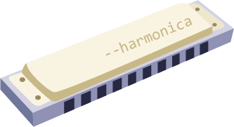

# harmonica [](https://travis-ci.org/shellscape/harmonica)

> A module that allows use of Node.js --harmony flags, programmatically.



## Node Version Requirements

Harmonica should work with Node.js version 4.6.2 and higher. However, specifying
flags which don't exist for a particular version will likely result in an error.

## Usage

Install the module:

`npm install harmonica`

Initialize the module. By default, harmonica will use the `--harmony` flag,
which will enable all harmony, in-progress features.

```js
require('harmonica')();
```

## Specifying Flags

Should you need only specific flags, harmonica accepts a lone parameter. Create
an `Array` of strings representing the flags you want to enable, without the leading
hyphens.

```js
require('harmonica')([
  'harmony-array-values',
  'harmony-async-await'
]);
```

## Syntax Flags

Some flags, such as `--harmony-async-await`, enable syntax features in Node.js.
Should you require flags meant to extend the syntax, you must create an entry
point in a separate file from which to initialize harmonica. You can then
`require` the main script for your app, which contains the body of code.

Please see [the tests for an example](https://github.com/shellscape/harmonica/test)
which uses the `async` / `await` syntax.

## Listing Available Flags

If you have the need to view all available harmony flags for your version of node,
you may do so by executing the following in a terminal:

```bash
node --v8-options | grep "in progress"
```

## Attribution

[dcodeIO](http://dcode.io/) wrote and published the wonderful
[harmonize](https://github.com/dcodeIO/node-harmonize) module. Harmonica is a
complete rewrite of harmonize, but follows the same principles.

[@stuk](https://twitter.com/stuk) was kind enough to allow me to use the
'harmonica' module name in the NPM registry.
